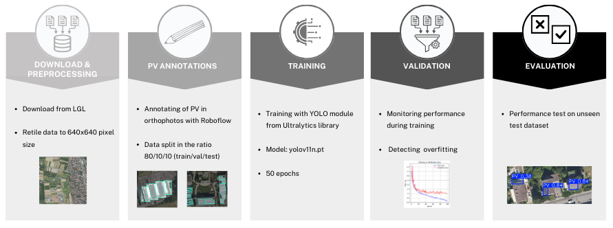
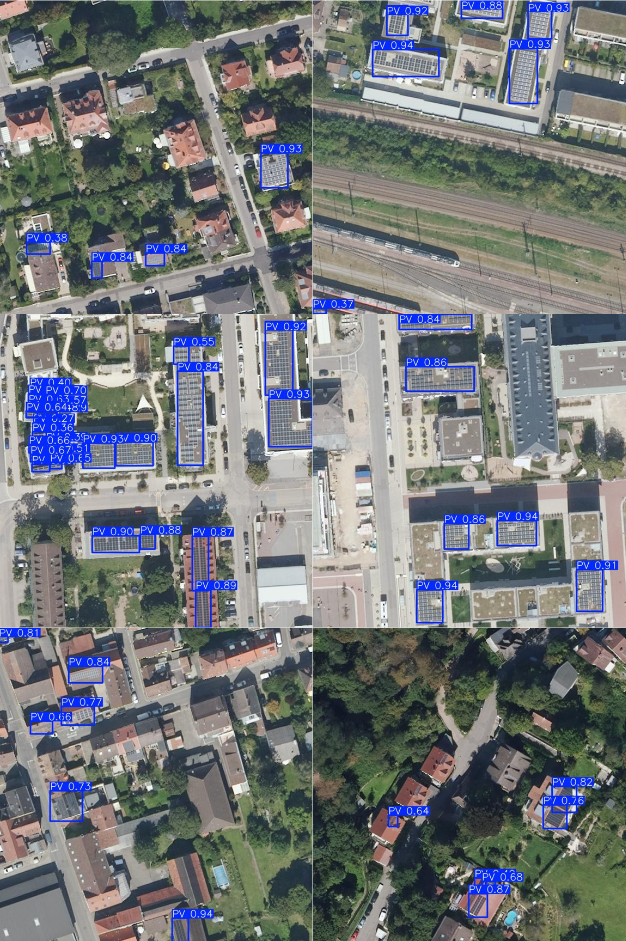

# GeoAI_DL_group_3

This repository contains the code and dataset for **PV Panel Detection from High-Resolution Aerial Imagery in
Heidelberg using Deep Learning**.
Find our detailed paper [here](https://www.overleaf.com/project/677820b2950a3589a06c9194).

*Figure 1: Workflow*

## Usage

### 1. Data
The original orthophoto was downloaded from [LGL-BW](https://opengeodata.lgl-bw.de/#/(sidenav:product/2)) and preprocessed. Then, it was manually labeled using Roboflow, split into three parts (train: 80%, val: 10%, test: 10%) and downloaded in the yolov11-format. The final training dataset can be found [here](https://github.com/KexsMaren/GeoAI_DL_group_3/tree/main/data/final_polygons.yolov11).

### 2. Training
The [training-folder](https://github.com/KexsMaren/GeoAI_DL_group_3/tree/main/training) contains the [train.py](training/train.py)- file used to train the model. Before running, check the paths in the train.yaml file.

### 3. Evaluation
The [evaluation-folder](https://github.com/KexsMaren/GeoAI_DL_group_3/tree/main/evaluation) contains the [eval.py](evaluation/eval.py)-file used to evaluate the model. Before running, check the paths in the eval.yaml file.

### 4. Results

You can execute the trained model via the [predict.py](predict.py)-file. It outputs the following results:

*Figure 2: Predictions on test dataset*
